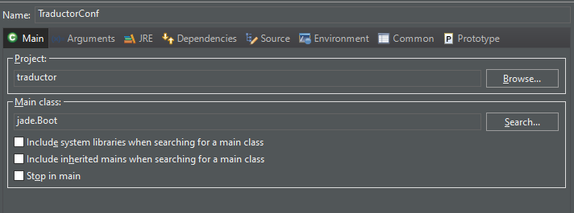

# PracticaSI
Practica para la asignatura de Sistemas Inteligentes

Para poder inicializar el proyecto, añade los jars de la carpeta /lib al classpath/buildpath.

En la configuración de run. crear uno nuevo con las siguientes características:

.png)

